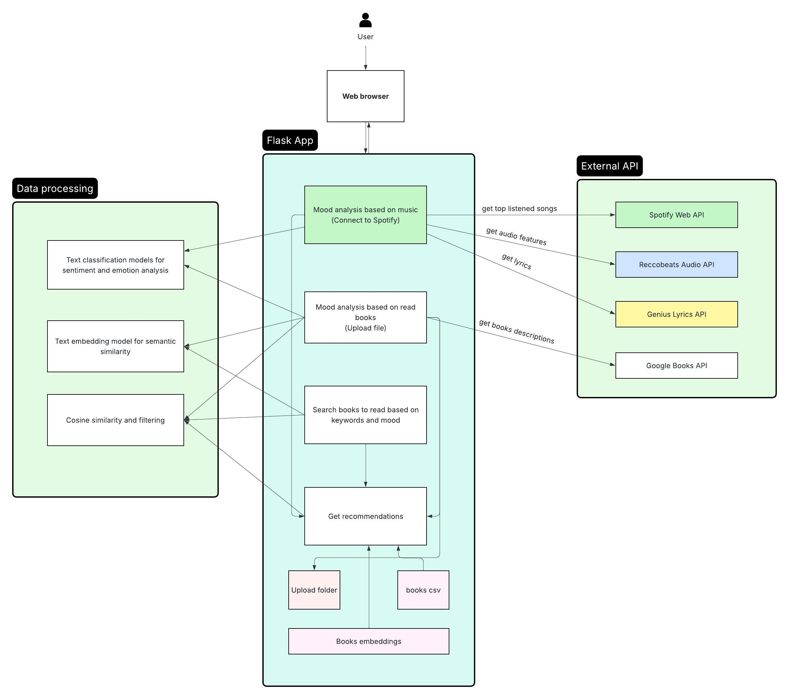

# MoodRecs
Moodrecs is a recommendation system that suggests books to read tailored to your mood based on the music you listen to and the books you have already read.

# Overview
The application recommends books to a user based on:
- Spotify listening mood
- User reading history (books the user has read and rated)
- Optional search queries (genre, description keywords, desired mood)
It combines these signals using text embeddings, emotion analysis, and mood filtering to generate personalized recommendations.

# Features
- The project already contains a sanitized database of 12k ca. books as a CSV and their embeddings
- Spotify mood detection
  - audio: valence and energy from songs are used to determine the moods (excited, angry, relaxed, sad) with a score between -1 and 1
  - lyrics: each song is given a score between -1 and 1
  - both of them are combined according to this formula: audio_score\*0.6 + lyrics_score\*0.4
- User book upload & analysis
  - only read books with more than a 3-star review are selected
  - for each book the description it is retrieved
  - an analysis is done and for each book there are six emotions: 'anger', 'disgust', 'fear', 'joy', 'neutral', 'sadness', 'surprise' (with the relative scores)
    - for the analysis two different models are used, one that supports only English books and another for books in other languages
  - at the end the text embeddings are computed for the user's books
- Diversification of top-N recommendations
  
# Project Structure
```bash
MoodRecs/
│
├── static/
│   ├── images/
|   |   ├── music-book.png
|   |   ├── no-cover.png
│   └── style.css
│
│── templates/
|   ├── index.html
|   ├── recommend.html
│   └── upload.html
|
├── .gitignore
├── app.py
├── book_embeddings.npy
├── books.csv
├── music_mood_analyzer.py
├── process_user_data.py
├── README.md
├── requirements.txt
└── spotify_api.py
```
# Requirements
- Python 3.9 or later
- required libraries in requirements.txt
- APIs for Spotify Developer Account, Google Books API key, Genius API key, Reccobeats API

# How to set up
```bash
# Clone the Repository
git clone https://github.com/MariaPalcau/MoodRecs.git
cd FlaskProject

# Setup Virtual Environment
python -m venv venv
source venv/bin/activate

# Install Dependencies
pip install -r requirements.txt

# Setup .env file with the API keys

# Run Flask App
python app.py
```

# Architecture diagram

